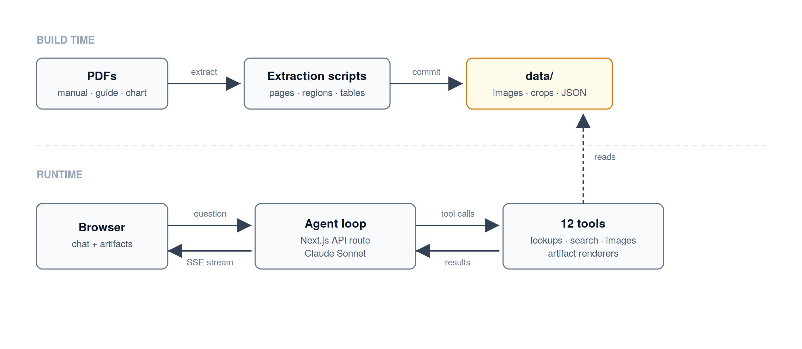

# Vulcan OmniPro 220 — multimodal assistant

 

A chat assistant for the Harbor Freight Vulcan OmniPro 220 multiprocess welder, built with the Anthropic Claude Agent SDK and Next.js. Ask it about duty cycle, polarity, settings, or a weld that isn't coming out right, and it answers in prose plus interactive artifacts: a duty-cycle calculator, a polarity diagram with the correct socket highlighted, a settings configurator, a troubleshooting wizard, and cropped images from the manual itself. Every factual claim cites an owner-manual page.

**Demo:** <https://prox-challenge-livid.vercel.app> · **Video:** <https://youtu.be/QZzbXRdWJa8>

## Running it

You need Node.js 20.9+ (which includes npm) and git.

```bash
git clone https://github.com/koushikpb/prox-challenge.git
cd prox-challenge
cp .env.example .env       # then edit .env and set ANTHROPIC_API_KEY to your key
npm install
npm run dev                # app runs at http://localhost:3000
```

Everything under `data/` is committed, so there is nothing to extract or index first. `ANTHROPIC_API_KEY` is the only required env var — get one at <https://console.anthropic.com>. It stays server-side, and the app starts and renders even without a valid key; chat requests just return a clear error until you set one.

Other scripts: `npm run typecheck`, `npm run lint`, `npm test` (Vitest), `npm run eval` (see [Evals](#evals)), and `npm run extract`, which rebuilds `data/` from the PDFs — you shouldn't need it.

## How it works



The knowledge source is three PDFs in `files/`: the 48-page owner manual, a 2-page quick-start guide, and the welder-door selection chart. At build time, scripts in `scripts/` render every page to a 300 DPI PNG with a text layer and crop out named regions like the polarity panels and the wiring schematic. Five structured tables (duty cycle, polarity, settings, troubleshooting, parts) are hand-authored against the manual, and every record carries its page citation. At 51 pages the corpus is small enough that hand-authoring beats an extraction pipeline, and it means every number the agent quotes traces to a real page.

All of that lives in `data/`, committed to the repo and validated against zod schemas at load time. The agent never opens a PDF at runtime.

At runtime, `src/agent/` drives a Claude tool loop (model `claude-sonnet-4-6`, at most 6 tool iterations per turn) over twelve server-only tools: strict lookups over the tables, manual search, page and region image fetches, one artifact renderer per artifact type, and a wiring-diagram generator. Responses stream to the browser as Server-Sent Events. The event and payload types live in `src/streaming/`, which imports neither the SDK nor the tools — that split keeps the agent code out of the client bundle.

A few rules in the system prompt carry most of the behavior:

- **Lookup, then render.** A numeric question calls the matching lookup tool, then the matching artifact renderer. Lookups never improvise — out-of-range input returns the nearest published band — and artifact payloads are schema-validated before they leave the server.
- **Cite everything.** Facts from the manual get an inline `(p. N)`, which the runtime turns into a citation event and the UI turns into a clickable page thumbnail. No tool-returned page, no citation.
- **Safety notes on actions, not topics.** "How do I change polarity sockets?" starts with _Heads up: unplug the welder before changing cable polarity._ "What polarity does TIG use?" doesn't. Anything touching wiring always gets the note.
- **Ask once, refuse plainly.** An ambiguous question gets exactly one clarifying question. A question the manual can't answer gets a plain "that's not in the manual" plus the nearest grounded fact.

One quirk worth knowing: the OmniPro 220 is a synergic machine. You enter wire diameter and material thickness on the LCD and the welder computes amperage and voltage itself (p. 20). The manual publishes no wire-feed-speed or voltage tables, so the settings artifact deliberately points you back to the LCD instead of inventing numbers.

## Artifacts

Six typed React components render inline in the chat, picked by the validated payload's `type`:

- **Duty cycle** — drag the amperage slider and see the rated percentage and on/off minutes for that band.
- **Polarity** — the correct socket highlighted, with the manual's own diagram beside it.
- **Settings** — a process/material/thickness recommender covering skill level, gas, flow rate, and prep.
- **Troubleshooting** — walks the manual's decision matrix one symptom at a time to a cause and numbered fixes.
- **Region** — a cropped manual image as a standalone card ("show me the wiring schematic"), with click-through to the full page.
- **Generated diagram** — for process-specific wiring questions, the model emits a node/edge graph and the client renders it as an SVG.

Model output never reaches the DOM as HTML, JS, or CSS. Payloads are zod-validated on the server and rendered from primitive props only.

## Evals

[`evals/cases.jsonl`](evals/cases.jsonl) holds 26 graded questions covering the lookups, the lookup → render pairing, the safety policy, clarification, refusals, image input, and generated diagrams. `npm run eval` runs them against a live dev server and checks five things per case: required facts in the prose, the expected page citation, the expected artifact type, clarification behavior, and the safety lead. Results are written to `evals/last-run.md`.
