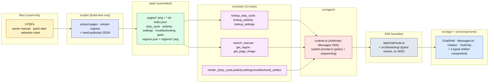

# Vulcan OmniPro 220 — multimodal assistant

 

An in-app assistant for the Harbor Freight Vulcan OmniPro 220 multiprocess welder, built on the **Anthropic Claude Agent SDK** in TypeScript and shipped as a single **Next.js (App Router)** app. The agent answers grounded technical questions about the welder — duty cycle, polarity setup, process selection, troubleshooting — and replies with prose plus inline **typed React artifacts** (interactive duty-cycle calculator, polarity diagram with the right socket highlighted, settings configurator, decision-tree troubleshooter) and cropped manual images. Every factual claim cites an owner-manual page.

**Demo:** <https://TBD — will be filled after Vercel deployment>

**Video:** <link — optional>

## Architecture

The pipeline is build-time PDF extraction → committed JSON + page renders → server-only runtime tools → Claude Agent SDK loop → SSE → typed React frontend. The full layered diagram lives in [`docs/architecture.md`](docs/architecture.md); the overview is below.



Layer summary:

- **Source PDFs (`files/`).** Three PDFs total: 48-page owner manual, 2-page quick-start guide, 1-page welder-door selection chart. Read-only — the agent never opens a PDF at runtime.
- **Build-time extraction (`scripts/`).** `extract-pages.ts` renders every PDF page at 300 DPI and writes both the PNG and a text layer. `extract-regions.ts` crops named regions out of the rendered pages with `sharp`. The five structured JSON tables are hand-authored against the manual with page citations baked into every record.
- **Committed knowledge (`data/`).** Everything the agent needs at runtime: page renders + per-page text, a manual index, the five structured tables, and the named regions registry. Checked into git so reviewers and Vercel deploys do not re-run the extractor.
- **Runtime tools (`src/tools/`).** Ten tools, all server-only: three strict lookups, three retrieval / image surfaces (`search_manual`, `get_region`, `get_page_image`), and four per-type `render_*_artifact` tools that validate their payload against the shared `ArtifactPayload` schema before emitting.
- **Agent (`src/agent/`).** `runtime.ts` drives the Anthropic Messages SDK loop (model `claude-sonnet-4-6`, max 6 tool loops per turn) and emits citations as the model writes them. `system-prompt.ts` enforces lookup → render pairing, citation format, safety-nudge policy, and the single-question clarification rule.
- **Streaming boundary (`src/app/api/chat/` + `src/streaming/`).** A single Route Handler streams Server-Sent Events to the browser. The `src/streaming/` module owns the shared `StreamEvent` and `ArtifactPayload` discriminated unions and imports neither the Anthropic SDK nor any tool code — this is the bundle-split point that keeps the agent SDK out of the browser.
- **Frontend (`src/app/` + `src/components/`).** Next.js App Router. The chat shell streams `text_delta` deltas, renders inline artifacts via a typed registry switched on the payload `type`, and surfaces image citations through a manual viewer. Model output never reaches the DOM as HTML, JS, or CSS — only as primitive props on validated payloads.

## How to run locally

The reviewer path is one command list. All `data/*` artifacts are committed — you do **not** need to run `npm run extract`.

```bash
git clone <your-fork>
cd prox-challenge
cp .env.example .env       # then set ANTHROPIC_API_KEY in .env
npm install
npm run dev                # http://localhost:3000
```

Environment:

- `ANTHROPIC_API_KEY` — required, server-only. The chat route returns a structured error if it is missing rather than crashing.
- `NEXT_PUBLIC_VOICE_ENABLED` — optional public flag, defaults to `false`. Toggles the (skeleton) voice controls in the composer.

Other useful scripts:

| Script | What it does |
| --- | --- |
| `npm run dev` | Start the Next.js dev server (port 3000). |
| `npm run typecheck` | `tsc --noEmit`. |
| `npm run lint` | ESLint over the workspace. |
| `npm test` | Vitest run — schema validators, parsers, agent runtime, rate limiter, cache, tools, artifact components. |
| `npm run eval` | End-to-end golden eval against a live local dev server. See [Validation approach](#validation-approach). |
| `npm run extract` | Author-time PDF extraction. Outputs are committed under `data/` — reviewers do not need to run this. |
| `npm run build` / `npm run start` | Production build / serve. |

## Knowledge extraction

The corpus is small (51 pages across three PDFs), so the design choice is to extract everything once at build time and commit the results under `data/`. That removes an entire class of runtime failure (PDF parsing in serverless, OCR drift, vector-store latency) and makes every grounded answer deterministic.

```
data/
├── pages/                      # 51 × .png (300 DPI) + 51 × .txt — every page of every PDF
├── index.json                  # per-page section / headings / text — backs search_manual
├── duty_cycle.json             # MIG/TIG/Stick × 120 V/240 V rated bands (p. 7)
├── polarity.json               # process → DCEP/DCEN + socket assignments + region_id (pp. 13, 14, 24, 27)
├── settings.json               # process × material × thickness selection guidance (selection chart p. 1 + p. 20)
├── troubleshooting.json        # decision trees for weld defects + hardware faults (pp. 13–14, 37, 40, 42–43)
├── parts.json                  # parts list keyed to the exploded diagram (pp. 46–47)
├── regions.json                # named cropped regions registry
└── regions/                    # 9 × .png — polarity diagrams, LCD synergic display, wiring schematic, etc.
```

`extract-pages.ts` uses `pdf-to-img` + `pdfjs-dist` to render and `extract-regions.ts` uses `sharp` to crop. The structured tables are hand-authored — the corpus does not justify an LLM-extraction step and the explicit page citation per record is what powers the citation badges in the UI. Schemas in `src/data/schemas.ts` and `src/tools/load-data.ts` validate every file at module init; a file that fails validation is a load-time error, not a silent fallback.

**Synergic-welder caveat.** The OmniPro 220 is a synergic auto-weld machine — the operator enters wire diameter and material thickness on the LCD and the welder computes the recommended amperage and voltage on-screen (p. 20). The manual does not publish numerical WFS/V tables, so `data/settings.json` is process-selection guidance (skill level, gas requirement, SCFH band, applications, cleanliness) and always carries a synergic note pointing back at the LCD. The agent will not invent WFS/V numbers.

## Agent design

The agent uses ten tools and a tightly-scoped system prompt. The two policies that do most of the work:

1. **Strict-lookup → render pairing.** Any numeric or tabular question pulls the matching strict-lookup tool first, then the matching `render_*_artifact`. The lookup tools never compose numbers from prose; out-of-range input returns the nearest grounded band rather than fabricating. The render tools validate their payload against `ArtifactPayload` before emitting, so a malformed payload becomes a `tool_result` error instead of a broken UI. The pairs are:
   - `lookup_duty_cycle` → `render_duty_cycle_artifact`
   - `lookup_polarity` → `render_polarity_artifact`
   - `lookup_settings` → `render_settings_artifact`
   - troubleshooting symptoms (weld defects + hardware faults) → `render_troubleshoot_artifact`
2. **Citations per page.** Every factual claim from the manual is followed by `(p. N)` inline. The runtime regex-scans the streamed text and emits a `citation` event the first time each page is referenced; the UI matches it to a real `data/pages/<source>-<NNN>.png` and surfaces a clickable thumbnail. Pages without a tool-returned `source_page` are not cited — guessing is a prompt violation.

Other policy:

- **Safety nudges fire on action verbs, not topics.** "How do I change polarity sockets for solid-core MIG?" leads with `Heads up: unplug the welder before changing cable polarity.` — "What polarity does TIG use?" does not. A hard override covers any question containing the word "wiring" (region surfaces always lead with the canonical safety line from the region caption).
- **Clarification is one question and stops.** A bare settings / polarity / process question that names neither a process nor a material returns a single clarifying question whose last visible character is `?`. No defaults, no trailing prose, no hybrid "here's what I'd guess" answers.
- **Refusal is plain.** If a fact is not in tool output, the agent says so and offers the nearest grounded fact with its source — it does not invent specifications.

Implementation lives in [`src/agent/system-prompt.ts`](src/agent/system-prompt.ts) (policy) and [`src/agent/runtime.ts`](src/agent/runtime.ts) (the tool loop and citation emitter). The model is `claude-sonnet-4-6` with a 2048-token cap and at most 6 tool-use iterations per user turn.

## Artifacts

Four typed React artifacts, registered in [`src/components/artifacts/index.tsx`](src/components/artifacts/index.tsx) and rendered inline in the chat by switching on the validated payload's `type` field.

| Artifact | Why it exists |
| --- | --- |
| **DutyCycleArtifact** | The manual publishes discrete bands (e.g. MIG @ 200 A on 240 V = 25 % rated, 2½ min on / 7½ min off). The artifact lets the user drag the amperage slider and re-compute work/rest minutes locally — the prose names the rated point, the artifact lets the user explore the band around it. |
| **PolarityArtifact** | Polarity is a "which cable goes where" question. A diagram with the right socket highlighted is faster than two sentences, and the cropped polarity region (e.g. `polarity_DCEP_solid_core.png`) is shown beside it for the manual ground-truth. |
| **SettingsConfiguratorArtifact** | A process / material / thickness recommender that surfaces skill level, gas requirement and SCFH band, cleanliness, and applications. Because the welder is synergic, the artifact does **not** compute WFS or voltage — it always points back to the LCD Auto Weld display (p. 20). |
| **TroubleshootingArtifact** | The manual's troubleshooting matrices branch on user-supplied symptoms (gas leak? dirty workpiece? wrong polarity?). A decision-tree wizard walks the tree one branch at a time and lands on a cause + numbered fixes, which is closer to how someone debugs a bad weld than a flat table is. |

Every artifact payload is validated against the `ArtifactPayload` zod schema in [`src/streaming/parser.ts`](src/streaming/parser.ts) before it leaves the server. This is how model output is prevented from reaching the UI as raw HTML, JS, or CSS — it can only ever flow through typed React props with primitive values.

## Validation approach

The eval suite is **20 graded questions** in [`evals/golden.jsonl`](evals/golden.jsonl), scored against five rubric checks defined in [`evals/rubric.ts`](evals/rubric.ts):

| Check | What it measures |
| --- | --- |
| `facts` | Required substrings appear in the streamed prose (case-insensitive). |
| `image` | An expected `citation` event resolves to a real `data/pages/<source>-<NNN>.png`. |
| `artifact` | The expected `ArtifactPayload['type']` appears in the stream (or `null` means no artifact expected). |
| `clarification` | The last visible character of the prose is `?` when the question is intentionally ambiguous (and is not when it isn't). |
| `safety` | The first paragraph starts with a `Heads up: …`-style nudge on action / wiring questions only. |

`npm run eval` boots a local Next.js dev server, POSTs each entry to `/api/chat`, parses the SSE stream, applies the rubric, and writes [`evals/last-run.md`](evals/last-run.md). Latest run: **20 / 20 pass** (model `claude-sonnet-4-6`).

The suite covers the three original README example questions (duty cycle at 200 A on 240 V; flux-cored porosity; TIG polarity + ground-clamp socket) plus 17 additional entries that exercise the lookup → render pairing, the action-vs-reference safety policy, the single-question clarification rule, and the refusal-with-nearest-fact behavior on out-of-scope topics like titanium.

## Limitations and what's next

Honest list:

- **The manual is the only knowledge source.** Questions outside the three PDFs are refused with the nearest grounded fact — there is no live web tool, no third-party knowledge base, no support-thread retrieval. This is the right shape for a graded submission but a real product would extend the corpus.
- **The eval is 20 questions, not a regression test for every welder fact.** It is good enough to catch the canonical failure modes (under-rendering artifacts, mis-firing safety nudges, hybrid clarify+answer responses) but it is not exhaustive.
- **Voice is a skeleton.** `NEXT_PUBLIC_VOICE_ENABLED=true` enables a stub `useSpeech` hook in the composer. There is no production STT/TTS pipeline behind it.
- **Observability is not wired up.** No request tracing, no eval-on-deploy, no usage / latency dashboards. The Route Handler logs to stdout and that's it.
- **No multi-turn personalisation.** Each request validates against the same schema and the server-side cache is keyed on the full message array; there is no user model or persistent session beyond the optional `session_id` field.

Plausible next steps: bring the quick-start guide into the structured tables (currently text-only in `index.json`), add an "open this in the manual" pane that scrolls the rendered PDF, wire the voice path to a real STT, and add an eval-on-deploy GitHub Action that runs `npm run eval` against the preview URL.

---

## About this challenge

This repository was originally forked from the **Prox Founding Engineer Challenge**. The brief, scoring criteria, and original example questions are preserved below.

### The product

The [Vulcan OmniPro 220](https://www.harborfreight.com/omnipro-220-industrial-multiprocess-welder-with-120240v-input-57812.html) is a multiprocess welding system sold by Harbor Freight. It supports four welding processes (MIG, Flux-Cored, TIG, and Stick), runs on both 120 V and 240 V input, and has an LCD-based synergic control system. Its owner's manual is 48 pages of dense technical content: duty-cycle matrices, polarity setup procedures that differ per process, wire-feed mechanism calibrations, wiring schematics, troubleshooting matrices, weld-diagnosis diagrams, and a full parts list. Additional video: <https://www.youtube.com/watch?v=kxGDoGcnhBw>.

### The task

Build a multimodal reasoning agent for the OmniPro 220 using the Anthropic Claude Agent SDK that answers deep technical questions accurately and helpfully — not just in text.

### Original example questions

1. *"What's the duty cycle for MIG welding at 200 A on 240 V?"*
2. *"I'm getting porosity in my flux-cored welds. What should I check?"*
3. *"What polarity setup do I need for TIG welding? Which socket does the ground clamp go in?"*

All three are entries Q01–Q03 in `evals/golden.jsonl` and pass on the latest run.

### What the challenge evaluates

- **Deep technical accuracy** — cross-referencing manual sections, understanding visual content, handling ambiguous questions.
- **Multimodal responses** — surfacing diagrams, generating interactive artifacts (duty-cycle calculators, troubleshooting flowcharts, settings configurators) rather than text-only answers.
- **Tone and helpfulness** — calm, competent, brief; assume the user is a curious adult in their garage with a new welder.
- **Knowledge extraction quality** — the manual mixes text, tables, labeled diagrams, schematics, and decision matrices, and the agent must present visual content, not just paraphrase it.

### Tech requirements

- Anthropic Claude Agent SDK.
- Runs locally with a single API key in `.env`.

### Submission

Submit fork URLs through the form at <https://useprox.com/join/challenge>.
