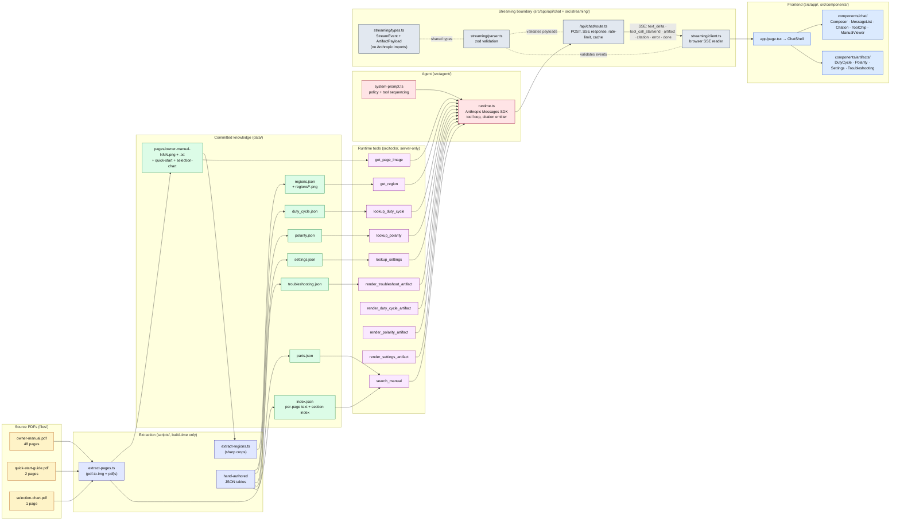

# Architecture

This is the detailed companion to the architecture overview in the project [README](../README.md). It shows the full pipeline from the three source PDFs in `files/` through the build-time extractor, the committed `data/*` artifacts, the runtime tools, the agent loop, the SSE streaming boundary, and the React frontend.

## Reading the diagram

1. **Source PDFs (yellow).** Three PDFs in `files/` are the only ground truth. They are checked in and treated as read-only references — the agent never re-reads a PDF at runtime.
2. **Extraction (indigo).** Build-time-only Node scripts in `scripts/`. `extract-pages.ts` renders each PDF page to a 300 DPI PNG and extracts a per-page text layer; `extract-regions.ts` re-crops named regions out of the rendered pages with `sharp`. The structured tables (`duty_cycle.json`, `polarity.json`, `settings.json`, `troubleshooting.json`, `parts.json`) are hand-authored against the manual with explicit page citations — the small corpus does not justify an LLM-extraction step.
3. **Committed knowledge (green).** Everything the agent consults at runtime lives under `data/` and is checked into git. Reviewers and Vercel deployments rely on these committed artifacts — `npm run extract` is a one-shot author-time script, not a deploy step.
4. **Runtime tools (purple).** Ten tools, server-only. Six are lookup / search / image surfaces; four are typed `render_*_artifact` tools, one per artifact kind. The strict-lookup tools (`lookup_duty_cycle`, `lookup_polarity`, `lookup_settings`) never fabricate values — out-of-range input is mapped to the nearest grounded band rather than guessed.
5. **Agent (pink).** `src/agent/runtime.ts` drives the Anthropic Messages SDK tool loop (model: `claude-sonnet-4-6`, max 6 tool loops per turn). The system prompt in `src/agent/system-prompt.ts` enforces the lookup → render pairing, citation discipline, the safety-nudge policy, and the single-question clarification rule.
6. **Streaming boundary (slate).** `src/app/api/chat/route.ts` is the only HTTP entry point. It validates the request, enforces a per-IP rate limit, reads a small response cache, then calls `streamAgentTurn` and serializes everything to Server-Sent Events. The discriminated `StreamEvent` union and `ArtifactPayload` schema live in `src/streaming/`, which imports neither the Anthropic SDK nor any runtime tool — this is the bundle-split point that keeps the agent SDK out of the browser.
7. **Frontend (blue).** A Next.js App Router page (`src/app/page.tsx`) mounts the chat shell. Artifact payloads are rendered by typed React components in `src/components/artifacts/`; the `RenderArtifact` switch matches on the `type` field of the validated payload, so the UI never receives free-form model output as code.

## Why this shape

- **Pre-extracted JSON over runtime PDF parsing.** The corpus is 51 pages across three documents. Extracting once, validating with zod, and committing the result removes an entire class of runtime failure (PDF parsing in serverless, OCR drift, retrieval latency) and makes every grounded answer deterministic.
- **Discriminated artifact union over free-form rich content.** Each artifact is a small, typed payload. The model fills in the slots; the UI owns the rendering. Model output never reaches the DOM as HTML, JS, or CSS — only as primitive props on validated payloads.
- **Single Next.js app on Vercel.** No separate backend, no extra service. `ANTHROPIC_API_KEY` is consumed only inside the Route Handler — never exposed to the browser bundle.
